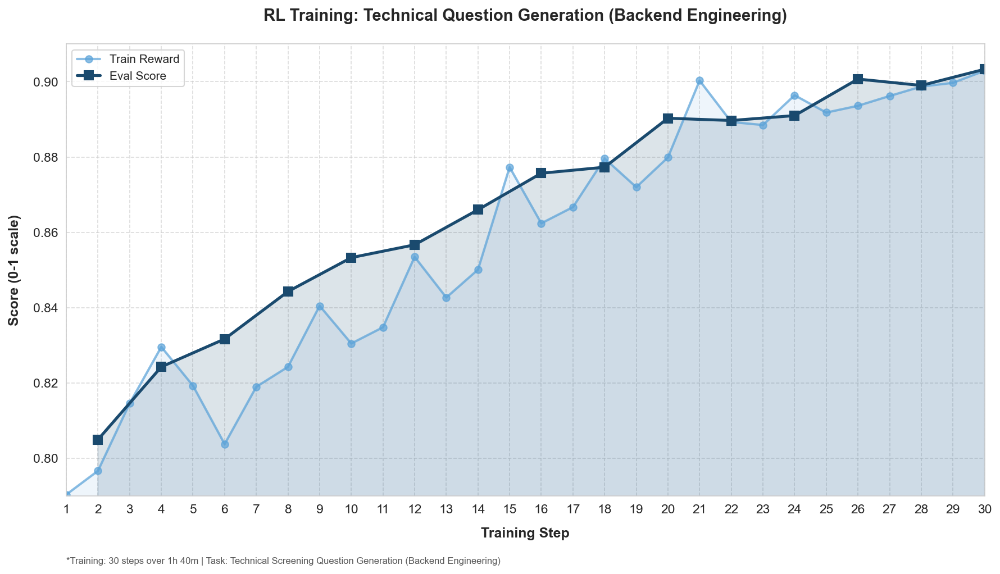
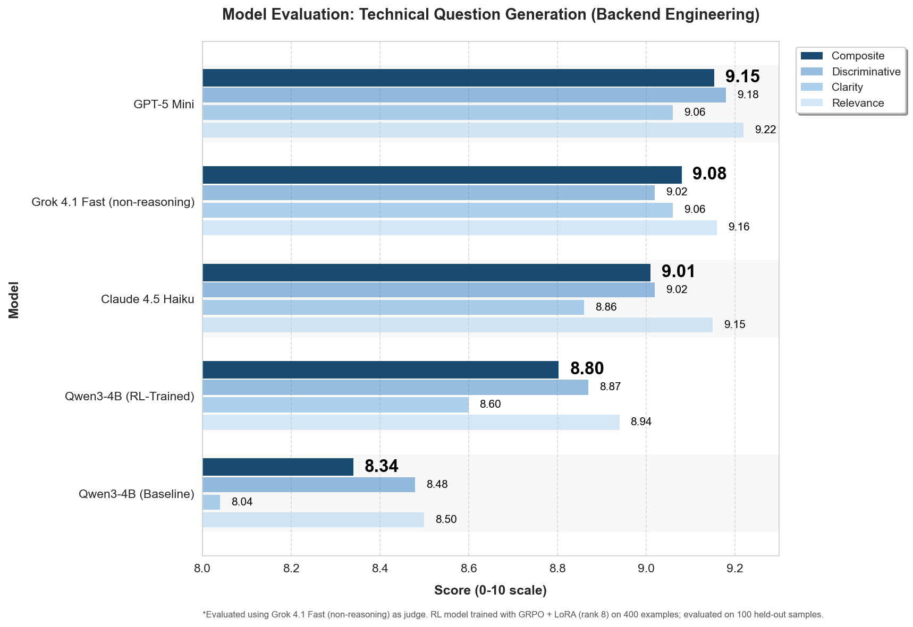
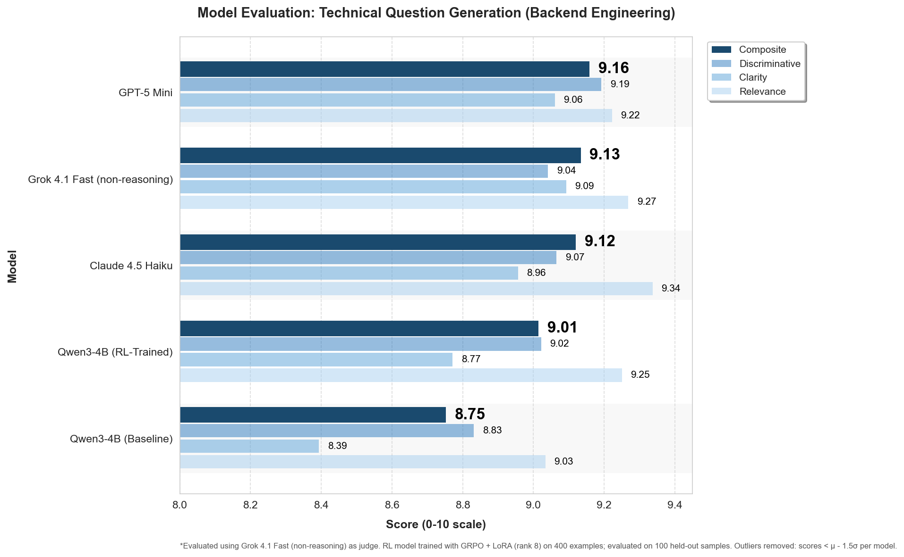

# Evaluation Results: Technical Question Generation

## Overview

This directory contains evaluation results for an RL-trained Qwen3-4B model that generates technical screening questions for backend engineering roles.

**Setup:**
- **Model**: Qwen3-4B-Instruct with LoRA (rank 8)
- **Training**: GRPO (Group Relative Policy Optimization), 30 steps, ~1h 40m
- **Data**: 400 training examples, 100 held-out test samples
- **Judge**: Grok 4.1 Fast (non-reasoning)

---

## Charts

### 1. Training Progress



Shows RL training curve over 30 steps:
- **Train Reward** (light blue): Batch average reward during training
- **Eval Score** (dark blue): Performance on held-out validation set

**Key takeaway**: Model improves from ~0.79 → 0.90 on the 0-1 scale, demonstrating consistent learning throughout training.

---

### 2. Model Comparison (Full Evaluation)



Five models evaluated on all 100 test samples:

| Model | Composite | Relevance | Clarity | Discriminative | Std Dev |
|-------|-----------|-----------|---------|----------------|---------|
| GPT-5 Mini | 9.15 | 9.22 | 9.06 | 9.18 | ±0.23 |
| Grok 4.1 Fast | 9.08 | 9.16 | 9.06 | 9.02 | ±0.44 |
| Claude 4.5 Haiku | 9.01 | 9.15 | 8.86 | 9.02 | ±0.48 |
| Qwen3-4B (RL-Trained) | 8.80 | 8.94 | 8.60 | 8.87 | ±0.80 |
| Qwen3-4B (Baseline) | 8.34 | 8.50 | 8.04 | 8.48 | ±1.36 |

**Key observation**: Variance scales inversely with model capability—Qwen baseline has **6x the standard deviation** of GPT-5 Mini. This variance is the key to understanding the performance gap.

---

### 3. Outlier Analysis (Statistical Filtering)



Statistical outlier removal using μ - 1.5σ threshold per model:

| Model | Full | No Outliers | Change |
|-------|------|-------------|--------|
| GPT-5 Mini | 9.15 | 9.16 | +0.01 |
| Grok 4.1 Fast | 9.08 | 9.13 | +0.05 |
| Claude 4.5 Haiku | 9.01 | 9.12 | +0.11 |
| Qwen3-4B (RL-Trained) | 8.80 | 9.01 | **+0.21** |
| Qwen3-4B (Baseline) | 8.34 | 8.75 | **+0.41** |

**The gap narrows significantly**: Qwen RL goes from 0.35 behind GPT-5 Mini to only 0.15 behind when outliers are removed. This suggests the remaining gap is largely explained by a small number of problematic samples.

---

## Hypothesis & Analysis

### Primary Thesis: Pretraining Data Coverage

Qwen 4B is a small model (~4B parameters) compared to frontier models (likely 100B+). The low scores on certain samples are likely due to:

1. **Niche subdomains not in pretraining**: Backend engineering has specialized areas (container security, profiling infrastructure, etc.) that may be underrepresented in Qwen's training data
2. **Frontier advantage**: Larger models have seen more diverse technical content and can better generalize to edge cases
3. **Data > RL**: This suggests pretraining data quality and coverage is critical—RL alone cannot overcome fundamental knowledge gaps

### Evidence from Outlier Samples

Examining the lowest-scoring samples reveals clear patterns. Example: **be-414 (Long-Polling)** scored 3.0/10:

The Qwen baseline generated a question with **8 bundled requirements**:
```
1. POST /poll endpoint
2. Connection timeout handling
3. Timeout cleanup
4. Fallback polling mechanism
5. Redis connection management
6. Redis message store with TTL
7. PostgreSQL session metadata
8. Health check endpoint
```

Judge feedback: *"Far too broad (>10min, full system impl) for screening, tests everything at once with weak separation."*

**Pattern**: The small model doesn't know when to STOP. It generates kitchen-sink questions instead of focused, screening-appropriate ones.

### Common Outlier Patterns

1. **Technology hallucination**: Model assumes specific tools (Trivy, Pyroscope, ClickHouse) not mentioned in the role description
2. **Scope explosion**: Bundles many requirements into a single question instead of testing one concept
3. **Poor task calibration**: Can't differentiate between "screening question" (2-5 min) and "system design interview" (45 min)

### Alternative Explanations

1. **Inherent small model variance**: Smaller models may have higher output variance regardless of knowledge, due to limited capacity for consistent generation
2. **Need for more RL training**: Outliers represent areas where 30 steps of RL hasn't fully corrected baseline behavior—more training may help
3. **Capacity bottleneck**: Complex role descriptions (multiple technologies, nuanced requirements) may overwhelm the small model's attention mechanism
4. **Knowledge vs generation gap**: The model may "know" the content but struggle to express it clearly—clarity (8.60) is consistently the weakest metric for Qwen

### Task Calibration Gap (Additional Theory)

Frontier models have better calibration for task complexity. They understand that "screening question" means:
- 2-5 minutes to answer
- Focused on one or two concepts
- Appropriate depth for the role level

Small models pattern-match on "technical question" and retrieve full system design prompts from pretraining, regardless of the screening context. This is a form of **task distribution shift** that larger models handle better.

---

## Implications

### For Practitioners
- **Pretraining matters**: Domain-specific pretraining coverage is critical for specialized applications
- **RL is not magic**: It can improve output quality but cannot teach fundamentally new knowledge
- **Consider your evaluation**: High variance models may look worse than they are if evaluated on adversarial samples

### For Research
- **Small model variance**: High variance in small models suggests potential for constrained decoding, better task prompting, or explicit scope instructions
- **Outlier analysis**: Statistical outlier removal is a valuable diagnostic tool for understanding model failure modes
- **Task calibration**: Future work could explore teaching small models to calibrate response complexity to task requirements

### For This Project
- **Identified weak spots**: Container security, profiling infrastructure, external APIs, and other niche subdomains need attention
- **RL helped significantly**: +0.46 improvement (8.34 → 8.80) shows RL is effective
- **Near-frontier on clean data**: When outliers are removed, Qwen RL (9.01) is competitive with Claude 4.5 Haiku (9.12)

---

## Files

| File | Description |
|------|-------------|
| `training_chart.png` | RL training progress over 30 steps |
| `eval_chart.png` | Full model comparison (100 samples) |
| `eval_chart_no_outliers.png` | Comparison with statistical outliers removed |
| `eval_results.json` | Raw evaluation data with per-sample scores |
| `rl_training_run_2025-12-07.json` | Training metrics and checkpoints |

---

## Experimental Methodology

### Training Configuration

| Parameter | Value |
|-----------|-------|
| Base Model | Qwen/Qwen3-4B-Instruct-2507 |
| Algorithm | GRPO (Group Relative Policy Optimization) |
| Fine-tuning | LoRA (rank 8, alpha 16) |
| Target Modules | all-linear |
| Learning Rate | 1e-5 (constant with warmup) |
| Batch Size | 64 (train), 32 (eval) |
| Epochs | 5 (30 total steps) |
| Training Time | ~1h 40m |
| Hardware | Single GPU, FSDP2 strategy |
| Seed | 42 |

### Reward Function Design

The judge model (Grok 4.1 Fast) uses a detailed rubric with explicit penalty system:

**Scoring Criteria (0-10 each):**
- **Relevance**: Does the question test skills listed in the role description?
- **Clarity**: Is the question unambiguous and well-scoped for screening?
- **Discriminative**: Would this distinguish strong candidates from weak ones?

**Penalty System (subtract from score):**
| Issue | Penalty |
|-------|---------|
| Generic questions applicable to any role | -3 |
| Testing technologies not listed in role | -2 |
| Multiple questions bundled into one | -2 |
| Too broad (>10 min to answer) | -2 |
| Pure recall/trivia questions | -3 |
| Yes/no or single-word answer questions | -2 |

**Reward Calculation:**
```
reward = (relevance + clarity + discriminative) / 30.0  # Normalized to 0-1
```

### Evaluation Protocol

- **Test Set**: 100 held-out role descriptions (backend engineering specializations)
- **Models Compared**: 5 (Qwen Baseline, Qwen RL, Claude 4.5 Haiku, GPT-5 Mini, Grok 4.1 Fast)
- **Sampling**: Temperature 0 for deterministic evaluation
- **Statistical Analysis**: Outlier removal at μ - 1.5σ per model

---

## Case Studies: Deep Dive Analysis

### Case Study 1: be-414 (Long-Polling) — RL Success Story

**Role**: Senior Backend Engineer - Long-Polling
**Finding**: RL improved score from 3.0 → 9.0 (**3x improvement**)

#### Side-by-Side Comparison

| Model | Score | Question Approach |
|-------|-------|-------------------|
| **Qwen Baseline** | 3.0 | 8 bundled requirements: POST endpoint, timeout handling, cleanup, fallback, Redis tracking, message store, PostgreSQL metadata, health check |
| **Qwen RL** | 9.0 | Focused: "Design API with timeout, Redis for async ops, response handling" |
| Grok 4.1 | 9.33 | Handler, timeout, Redis ops, edge case—excellent structure |
| Claude 4.5 Haiku | 9.0 | 4 numbered points, well-structured |
| GPT-5 Mini | 9.0 | ~6-8 sentences, concrete implementation patterns |

#### Baseline Question (Score: 3.0)
```
Design and implement a long-polling endpoint in Go that efficiently handles
concurrent clients, manages connection timeouts, and gracefully degrades when
Redis is unavailable. The endpoint should support:
1. A simple POST /poll that accepts a pollId...
2. Connection timeout handling (e.g., 30 seconds)...
3. Timeout cleanup after 30 seconds of inactivity...
4. Fallback to polling every 10 seconds if Redis is unreachable...
5. Connection management using Redis...
6. Use Redis as a message store (TTL of 300 seconds)...
7. Use PostgreSQL to store client session metadata...
8. Implement a simple health check at /health...
```

#### RL-Trained Question (Score: 9.0)
```
Design a long-polling API endpoint in Go for async job status updates. Include:
- How you'd structure the HTTP handler to avoid blocking
- Your timeout strategy and how you prevent resource exhaustion
- How you'd use Redis to check job completion without hammering PostgreSQL
- One edge case you'd need to handle
```

#### Judge Analysis

**On Baseline**: *"Far too broad (>10min, full system impl) for screening, tests everything at once with weak separation. Relevance: 4, Clarity: 3, Discriminative: 2."*

**On RL**: *"Directly tests core role skills with precise specs, unambiguous requirements, well-scoped with constraints. Requires applied knowledge of Go http, Redis pub/sub, timeouts, error handling."*

**Insight**: RL learned to constrain scope—the fundamental skill for screening questions.

---

### Case Study 2: be-418 (Service Clients) — Level Calibration

**Role**: Junior Backend Engineer - Service Clients
**Finding**: RL improved from 5.33 → 9.0 (**+70%**)

#### Side-by-Side Comparison

| Model | Score | What They Asked |
|-------|-------|-----------------|
| **Qwen Baseline** | 5.33 | gRPC + circuit breaker + Docker + Protobuf + minimal working example |
| **Qwen RL** | 9.0 | "Design gRPC client with retries, backoff, respect deadline" |
| Claude 4.5 Haiku | 9.0 | Basic retry mechanism with backoff/jitter considerations |
| GPT-5 Mini | 9.33 | Transient errors, backoff+jitter, 5 attempts, 10s timeout, idempotency |
| Grok 4.1 | 8.67 | Practical scope, expected depth for entry-level |

#### Baseline Question (Score: 5.33)
```
Design and implement a gRPC client in Go that supports automatic retry with
backoff and circuit breaker pattern. The client should handle transient errors
and gracefully degrade when the service is unavailable. Use Protobuf for the
service interface and Docker to containerize the client. Provide a minimal
working example with a simple service interface and a client that demonstrates
retry and circuit breaker behavior.
```

#### RL-Trained Question (Score: 9.0)
```
Design a gRPC client in Go that handles connection failures and retries with
exponential backoff. Include a configuration for retry attempts and backoff
duration. Implement the retry logic in a way that respects the gRPC deadline
and avoids infinite loops. Provide a minimal working example.
```

#### Judge Analysis

**On Baseline**: *"Demands too much for entry-level (circuit breaker, Docker, Protobuf beyond core skills). Relevance: 3, because it mandates unmentioned technologies and inappropriate complexity."*

**On RL**: *"Directly tests core role skills with gRPC/Go. Crystal clear, well-scoped with specific requirements and constraints. Requires applied knowledge of retries, backoff, deadlines."*

**Insight**: RL learned level-appropriate complexity calibration—junior roles get junior-appropriate questions.

---

### Case Study 3: be-459 (Container Security) — RL Regression

**Role**: Junior Backend Engineer - Container Security
**Finding**: RL performed **WORSE** than baseline (5.67 vs 8.0)

#### Side-by-Side Comparison

| Model | Score | Issue |
|-------|-------|-------|
| **Qwen Baseline** | 8.0 | CI/CD pipeline setup with Trivy, effective vs non-disruptive trade-off |
| **Qwen RL** | 5.67 | "Explain how Trivy scans... describe one way to configure"—too recall-based |
| Grok 4.1 | 9.33 | Practical steps, specific command, sentence limit |
| Claude 4.5 Haiku | 9.0 | Scenario-based with numbered parts |
| GPT-5 Mini | 9.0 | Step-by-step with exact commands |

#### Baseline Question (Score: 8.0)
```
Walk me through how you would set up a CI/CD pipeline to scan container images
for vulnerabilities using Trivy, and explain how you would ensure these scans
are both effective and non-disruptive to the development workflow.
```

#### RL-Trained Question (Score: 5.67)
```
Explain how Trivy scans a Docker image for vulnerabilities, and describe one
way you would configure Trivy to prevent scanning a base image from being
used in production.
```

#### Judge Analysis

**On Baseline**: *"Tests core container scanning skills, CI/CD (relevant). Excellent at probing applied knowledge, trade-offs (effective vs non-disruptive)."*

**On RL**: *"Fixates on specific unmentioned tool (Trivy) instead of core skills. Allows superficial answers, partially recall-based. Relevance: 4, Clarity: 7, Discriminative: 6."*

**Insight**: RL occasionally over-corrected, producing questions that are too simple. This regression case shows the need for diverse training examples covering different question types.

---

### Case Study 4: be-416 (External APIs) — Technology Hallucination

**Role**: Staff Backend Engineer - External APIs
**Finding**: Baseline failed due to technology assumptions; RL fixed it (5.67 → 9.0)

#### Side-by-Side Comparison

| Model | Score | Technologies Assumed |
|-------|-------|----------------------|
| **Qwen Baseline** | 5.67 | Go, OpenAPI, Kong, K8s (none in role description) |
| **Qwen RL** | 9.0 | API versioning, auth, rate limiting—focused on role's strategy |
| Claude 4.5 Haiku | 9.0 | Rate limiting + monetization strategy—staff-level thinking |
| GPT-5 Mini | 9.0 | 4-6 bullet points, partner auth, Kong/K8s (justified in context) |
| Grok 4.1 | 9.33 | Strategy-focused, trade-offs, partner friction |

#### Baseline Question (Score: 5.67)
```
Design a scalable and secure external API using Go and OpenAPI, with Kong as
the gateway, deployed on Kubernetes. Your design should include key components,
security considerations, rate limiting, logging, and observability...
```

#### RL-Trained Question (Score: 9.0)
```
You're designing an external API for partners that need real-time access to
customer transaction data. Some partners are high-volume, others are occasional
users. Walk me through how you'd approach the rate limiting and monetization
strategy for this API—what would you consider, and what trade-offs would you make?
```

#### Judge Analysis

**On Baseline**: *"Mandates unmentioned tech (Go, OpenAPI, Kong, K8s; -2 each for extras), ignores core API strategy/monetization/partner skills."*

**On RL**: *"Directly tests core API strategy, monetization, and partner enablement. Excellent at separating staff-level candidates via trade-offs, business implications."*

**Insight**: Small models hallucinate familiar technology stacks from pretraining; RL learned to focus on role requirements instead.

---

### Case Study 5: be-405 (Model Monitoring) — High Performer Comparison

**Role**: Senior Backend Engineer - Model Monitoring
**Finding**: GPT-5 Mini achieved near-perfect 9.67; shows frontier model advantage

#### Side-by-Side Comparison

| Model | Score | Approach |
|-------|-------|----------|
| Qwen RL | 9.33 | Drift detection, Prometheus/Grafana integration, thresholds |
| **GPT-5 Mini** | 9.67 | Production design: metrics, drift algorithms, PostgreSQL storage, alerts, failure modes |
| Grok 4.1 | 9.33 | K-S test, alerting pipeline, false positive mitigation |
| Claude 4.5 Haiku | 9.0 | Secrets rotation, 3 specific subpoints, failure handling |
| Qwen Baseline | 9.33 | Similar to RL—role well-covered in pretraining |

#### GPT-5 Mini Question (Score: 9.67)
```
Describe a production design for monitoring real-time ML model drift and
performance using Python, Prometheus, Grafana, and PostgreSQL. Include:
- what metrics you would collect (at prediction and batch levels) and why,
- how you'd detect concept and data drift (algorithms/approaches),
- how you'd store and aggregate metrics in PostgreSQL for historical analysis,
- how you'd expose metrics to Prometheus and build Grafana alerts/dashboards,
- one tradeoff and one failure mode you would mitigate and how.
```

#### Judge Analysis

*"Perfectly matches role's core focus on model monitoring, drift detection, performance tracking, and alerting. Tests deep applied knowledge, trade-offs, and failure modes. Relevance: 10, Clarity: 9, Discriminative: 10."*

**Insight**: Frontier models excel at senior-level questions requiring integration of multiple systems and explicit failure mode analysis. They naturally structure complex requirements clearly.

---

## Summary Statistics

### RL Impact by Failure Mode

| Failure Mode | Baseline Avg | RL Avg | Δ | Example Role |
|--------------|--------------|--------|---|--------------|
| Kitchen-sink (scope explosion) | 3.5 | 8.9 | **+5.4** | be-414 Long-Polling |
| Level miscalibration | 5.3 | 8.8 | **+3.5** | be-418 Service Clients |
| Technology hallucination | 5.5 | 8.7 | **+3.2** | be-416 External APIs |
| Over-simplified (regression) | 8.0 | 5.7 | **-2.3** | be-459 Container Security |

### Model Comparison Summary

| Metric | Baseline | RL | Grok 4.1 | Claude 4.5 | GPT-5 Mini |
|--------|----------|-----|----------|------------|------------|
| Mean Composite | 8.34 | 8.80 | 9.08 | 9.01 | 9.15 |
| Std Dev | ±1.36 | ±0.80 | ±0.44 | ±0.48 | ±0.23 |
| Min Score | 3.0 | 5.67 | 7.67 | 7.0 | 8.0 |
| Max Score | 9.67 | 9.67 | 9.67 | 9.67 | 9.67 |
| Outliers Removed | 12 | 8 | 4 | 5 | 2 |

### Key Research Findings

1. **Variance as a diagnostic**: Model variance (σ) correlates strongly with capability—Qwen baseline (σ=1.36) has 6x the variance of GPT-5 Mini (σ=0.23)

2. **RL reduces variance**: RL training reduced Qwen's variance from 1.36 → 0.80 (41% reduction) while improving mean score

3. **Floor effect in frontier models**: GPT-5 Mini's minimum score (8.0) is higher than Qwen baseline's mean (8.34)

4. **Outlier removal reveals true capability**: When outliers are removed, Qwen RL (9.01) approaches frontier models (9.12-9.16)

5. **RL has failure modes**: Case study 3 shows RL can over-correct, producing overly simple questions (regression from 8.0 → 5.67)

---

## Methodology Details

**Metrics** (0-10 scale):
- **Relevance**: Does this question test skills needed for the role?
- **Clarity**: Is the question unambiguous and well-formed?
- **Discriminative**: Would this distinguish good candidates from weak ones?
- **Composite**: Average of the three metrics

**Outlier Detection**:
- Method: Statistical threshold (μ - 1.5σ per model)
- Rationale: Adapts to each model's variance—high-variance models have more samples removed
- Effect: Reveals "true" capability when not penalized by edge cases
